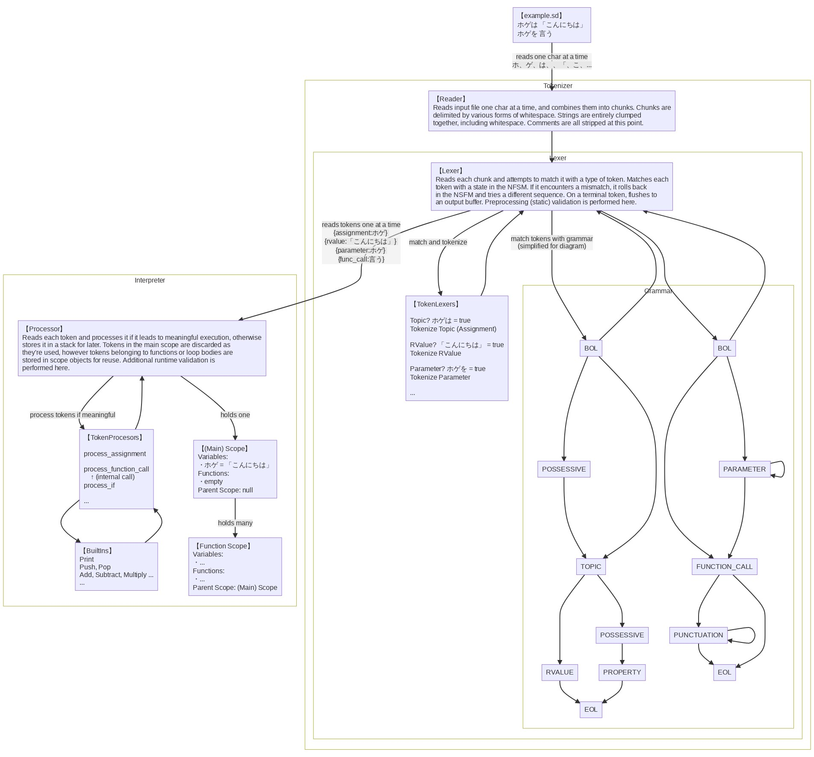

# About

## Why did you make this?

I like Japanese and I like programming. I've always felt that particles in Japanese, which identify different parts of a sentence or signify roles of words, were kind of like programming "operators". While not always true semantically, I imagined the topic particle は was kind of an "equals" sign. For example, 僕はリュウ means "I am Rew" or `me = rew`.

I was surprised to learn about the language [ひまわり](https://ja.wikipedia.org/wiki/ひまわり_%28プログラミング言語%29) and was interested in learning how to use it, until I found out that it was designed for Windows and was no longer being actively developed. I also learned about [なでしこ](https://ja.wikipedia.org/wiki/なでしこ_%28プログラミング言語%29) which is still active to this day and usable with node.js. In fact, if you want to actually get things done, I would definitely recommend なでしこ over 金魚草 as it is far more robust and provides a lot of useful features.

So, why did I make 金魚草?... I guess just because I wanted to.

Unlike なでしこ, 金魚草 is a bit more strict in its Japanese. Its basic syntax includes no traditional programming operators (aside from shared punctuation), function names are limited to verbs and their parameters are denoted by particles, and even basic math is written out in words, like "add 1 to 3" instead of `3+1`. This does, however, make it much more difficult to implement and more cumbersome to write. The set of real-world Japanese is infinitely larger than the set of grammar I can define and support. For example, basic arithmetic can all be written out as transitive verbs (`3に 1を 足す` = 3+1), but exponentiation cannot (`2の 3乗` = 2^3), nor can logarithms (`2を 底と する 8の 対数` = log\_2(8)), which means these must have their own language constructs.

That said, I think 金魚草 is still fun to play around with as an [esoteric language](https://en.wikipedia.org/wiki/Esoteric_programming_language) and I've ~~stolen~~ borrowed a lot of concepts that I found interesting from other languages as well.

* From **ひまわり** and its successor **なでしこ**: 金魚草 has a special "global" variable `それ` which always refers to the value of the last-executed statement. This is how you retrieve the return values from functions. You can also use it like a reference pronoun instead of referring to the same variable multiple times.

* From **Python**: the `・・・` keyword works like Python's `pass`, because I liked the idea of having an explicit "nothing to do here" kind of thing. Additionally, scopes are determined by their indent level, which I found to be clean and more human-readable than curly braces or "end" words (なでしこ uses the `ここまで` keyword here).

* From **Objective-C** (or rather **Smalltalk**): function parameters are part of the function name.

* From **Perl**: like the special variable `$_`, when looping, the current loop value is always assigned to `それ`. Similarly, returns and some calls to built-in functions can omit a target variable and `それ` will be used implicitly. Also like Perl: there is no exact "try-catch" construct. Risky code can be executed inside a `試す` block and errors are stored in a special variable `例外`, similar to Perl's `eval` and `$@`.

* From **Ruby**: you can suffix a `?` to the end of any variable or function call to have its value or return value cast to a boolean, similar to Ruby's convention of appending a question mark to functions to imply the return of a boolean.

* From **PHP**: arrays and associative arrays are internally "ordered maps" and, while not recommended, you can mix numeric and string keys.

General concepts:

* Overloading: two functions can have the same name as long as their parameter particles are different.

* Pass-by-value: everything (save for the parameters of a few specific built-ins) is passed by value. It's more restrictive, but it's simpler.

Original Ideas:

* Because function names are verbs, they can be conjugated to flow better syntactically. A function `読み込む` can be written as `読み込んで` or `読み込んだ`.

* Conflicting function name conjugations will throw an error, but you can shout (by appending `!`) to force the subsequent function's conjugations to overwrite the previous'. Shouting certain other keywords or built-in functions changes their behaviour as well.

  * Shouting function calls will suppress errors and stop them from propagating upward. Instead, the function will simply return null.

* Many keywords and built-in functions have variants which use only ひらがな instead of 漢字, because sometimes people have a preference for one or the other.

* Because parameters are distinguished by their particle, they can be passed to a function in any order. `3に 1を 足す` is the same as `1を 3に 足す`.

* Another special global exists called `あれ` which is just... There, free to use. There's no particular reason other than the fact that I find it funny how you can say あれだね at any point in a conversation and it can refer to whatever you or your conversational partner is thinking of. (It's also useful for passing data around to get around linguistic limitations.)

* All strings are like HEREDOCs (ie. you can newline them at any point but they'll be concatenated when processed)... Because why else would you write a string spanning multiple lines?

* All variables in a scope are read-only by functions defined within them. This differs from most other languages which are either read-write or no-read. I feel like this is a neat middle ground which opens possibilities without adding many safety concerns.

## How does it work?

For a detailed breakdown of the grammar, please see the [state machine diagram](./nfsm.md).



## Why is it written in Ruby?

Short answer: because I like Ruby.

Slightly longer answer: Personally, I find Ruby easy to use and easy to read. It has a ton of useful functions for manipulating enumerables or dynamic objects (useful for the pipeline described above), great support for regex and utf-8 (an obvious boon for working with Japanese), and if you don't mind breaking some rules, meta-programming in Ruby can cut out a lot of cruft and noisy code.

I know it's not the best for performance and I know 金魚草 itself isn't going to be breaking any benchmarks, but the number one rule for this project is to have fun.

## Thanks

Special thanks to:

* [@keisei803](https://github.com/keisei803)
* [@kanaf34](https://github.com/kanaf34)
* Jerry

For advice, testing, and suggestions.

---

Mermaid source (for above "How does it work?")

```
graph TB
  file -->|"reads one char at a time<br>ホ、ゲ、は、<space>、「、こ、..."| reader

  subgraph Tokenizer
    reader --> lexer

    subgraph Lexer
      lexer -->|match and tokenize| token_lexers
      --> lexer
      lexer -->|"match tokens with grammar<br>(simplified for diagram)"| bol1
      --> lexer
      lexer --> bol2
      --> lexer

      subgraph Grammar
        bol1[BOL] --> possessive1[POSSESSIVE]
        possessive1 --> TOPIC
        bol1 --> TOPIC
        TOPIC --> RVALUE
        RVALUE --> eol1
        TOPIC --> possessive2[POSSESSIVE]
        possessive2 --> PROPERTY
        PROPERTY --> eol1[EOL]

        bol2[BOL] --> PARAMETER
        --> PARAMETER
        bol2 --> fcall
        PARAMETER --> fcall[FUNCTION_CALL]
        fcall --> PUNCTUATION
        --> PUNCTUATION
        PUNCTUATION --> eol2[EOL]
        fcall --> eol2
      end
    end
  end

  lexer -->|"reads tokens one at a time<br>{assignment:ホゲ} <br>{rvalue:「こんにちは」} <br>{parameter:ホゲ} <br>{func_call:言う}"| processor

  subgraph Interpreter
    processor -->|process tokens if meaningful| token_processors
    --> processor
    token_processors --> built_ins
    --> token_processors

    processor -->|holds one| main_scope
    main_scope -->|holds many| fscope
  end

  file["【example.sd】<br>ホゲは 「こんにちは」<br>ホゲを 言う"]
  reader["【Reader】<br>Reads input file one char at a time, and combines them into chunks. Chunks are<br>delimited by various forms of whitespace. Strings are entirely clumped<br>together, including whitespace. Comments are all stripped at this point."]
  lexer["【Lexer】<br>Reads each chunk and attempts to match it with a type of token. Matches each<br>token with a state in the NFSM. If it encounters a mismatch, it rolls back<br>in the NSFM and tries a different sequence. On a terminal token, flushes to<br>an output buffer. Preprocessing (static) validation is performed here."]
  token_lexers["【TokenLexers】<br><br>Topic? ホゲは = true<br>Tokenize Topic (Assignment)<br><br>RValue? 「こんにちは」 = true<br>Tokenize RValue<br><br>Parameter? ホゲを = true<br>Tokenize Parameter<br><br>..."]
  processor["【Processor】<br>Reads each token and processes it if it leads to meaningful execution, otherwise<br>stores it in a stack for later. Tokens in the main scope are discarded as<br>they're used, however tokens belonging to functions or loop bodies are<br>stored in scope objects for reuse. Additional runtime validation is <br>performed here."]
  token_processors["【TokenProcesors】<br><br>process_assignment<br><br>process_function_call<br>　↑ (internal call)<br>process_if<br><br>..."]
  built_ins["【BuiltIns】<br>Print<br>Push, Pop<br>Add, Subtract, Multiply ...<br>..."]
  main_scope["【(Main) Scope】<br>Variables:<br>・ホゲ = 「こんにちは」<br>Functions:<br>・empty<br>Parent Scope: null"]
  fscope["【Function Scope】<br>Variables:<br>・...<br>Functions:<br>・...<br>Parent Scope: (Main) Scope"]

  classDef ltext text-align:left;
  classDef clearback fill:none;

  class file ltext;
  class reader ltext;
  class lexer ltext;
  class token_lexers ltext;
  class Tokenizer clearback;
  class Lexer clearback;
  class Grammar clearback;

  class processor ltext;
  class Interpreter clearback;
  class token_processors ltext;
  class built_ins ltext;
  class main_scope ltext;
  class fscope ltext;
```