# Non-Deterministic Finite State Diagrams / 非決定性有限状態図

The diagrams below describe the different sequences supported by 金魚草's grammar. Each sequence is shown in a sort of pseudo-regex format, and in Mermaid syntax which needs to be rendered by a supporting markdown editor.

## ASSIGNMENT

`BOL ASSIGNMENT ( RVALUE | ( POSSESSIVE PROPERTY ) ) QUESTION ? ( COMMA ( RVALUE | ( POSSESSIVE PROPERTY ) ) QUESTION ? ) * EOL`

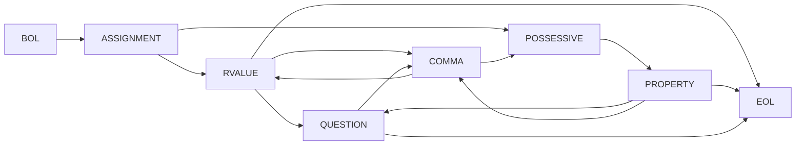

## FUNCTION\_DEF / FUNCTION\_CALL

`BOL PARAMETER * FUNCTION_DEF BANG ? EOL`

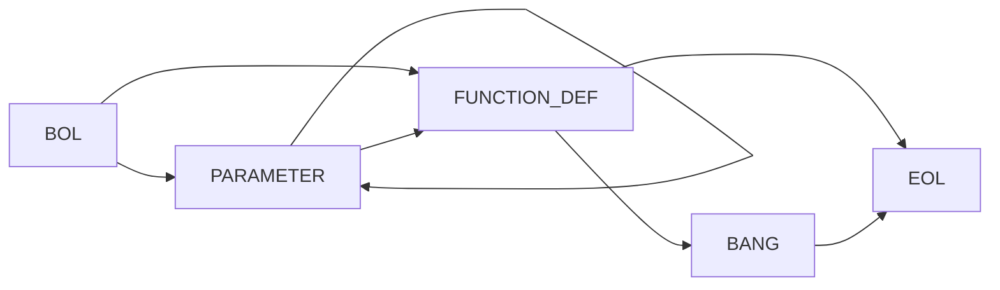

`BOL ( POSSESSIVE ? PARAMETER ) * FUNCTION_CALL BANG ? QUESTION ? EOL`

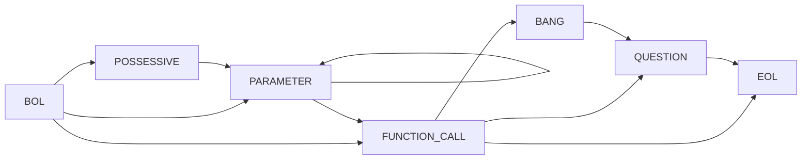

## RETURN

`BOL ( POSSESSIVE ? PARAMETER ) ? RETURN EOL`

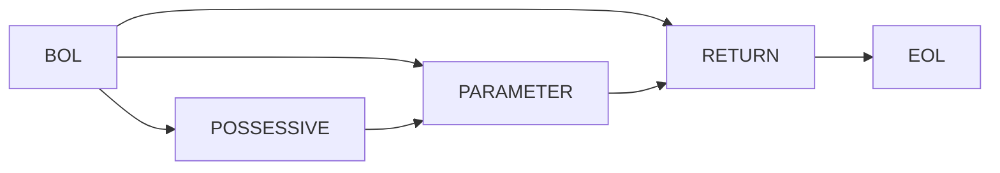

## LOOP / LOOP\_ITERATOR / NEXT / BREAK

`BOL ( PARAMETER ( PARAMETER | LOOP_ITERATOR ) ) ? LOOP EOL`

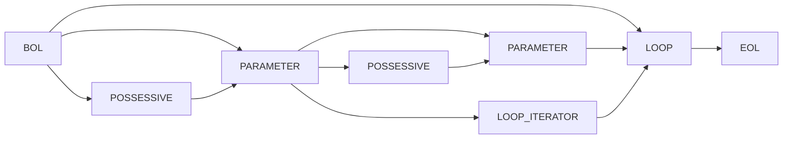

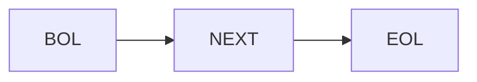

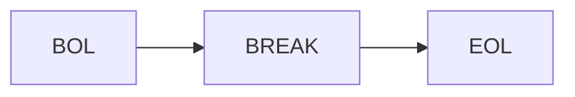

## IF / ELSE\_IF / ELSE

```rb
BOL ( IF | ELSE_IF ) ( POSSESSIVE ? COMP_1 ) ? POSSESSIVE ? (
                                                              ( COMP_2 QUESTION | COMP_2_GTEQ | COMP_2_LTEQ ) COMP_3
                                                              | COMP_2_TO ( COMP_3_EQ | COMP_3_NEQ)
                                                              | COMP_2_YORI ( COMP_3_LT | COMP_3_GT )
                                                            ) EOL
```

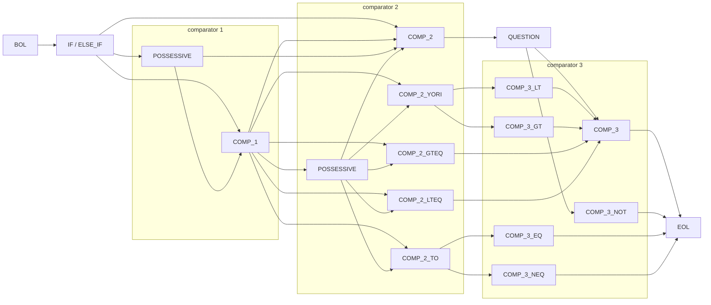

`BOL ( IF | ELSE_IF ) ( POSSESSIVE ? PARAMETER ) * FUNCTION_CALL BANG ? QUESTION ? ( COMP_3 | COMP_3_NOT ) EOL`


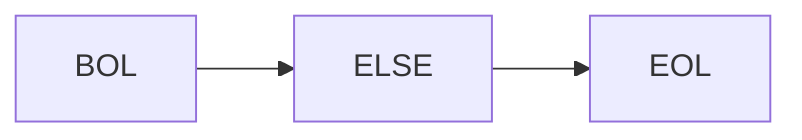

## MISC

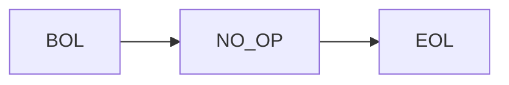

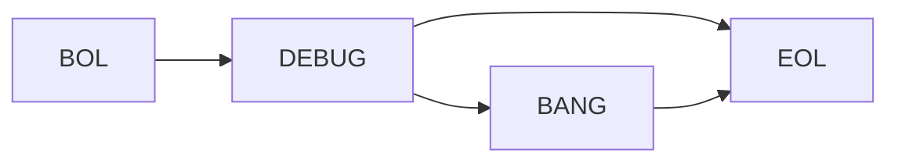
