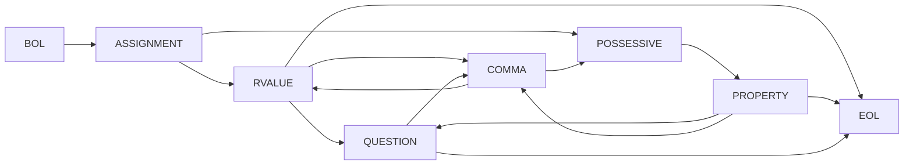
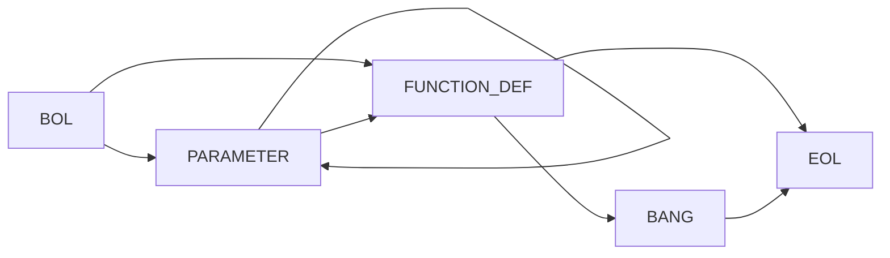
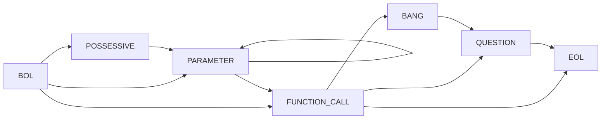
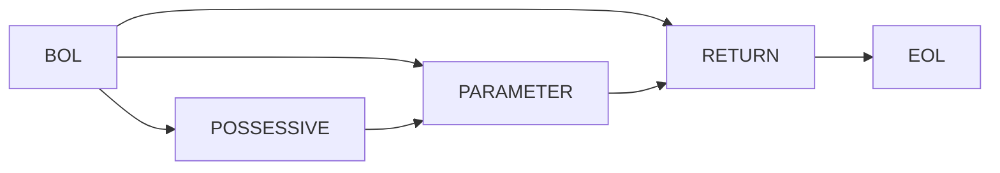
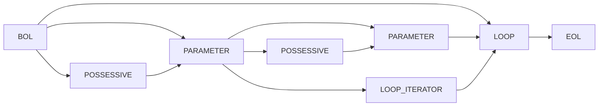
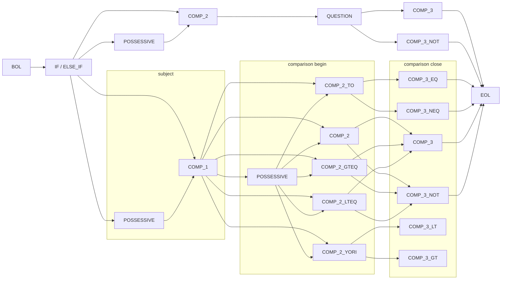
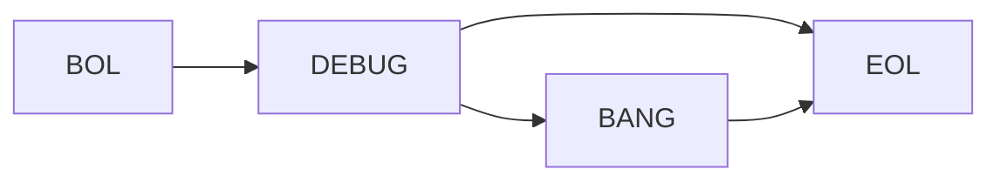

# Non-Deterministic Finite State Diagrams / 非決定性有限状態図

The diagrams below describe the different sequences supported by 金魚草's grammar. Each sequence is shown in a sort of pseudo-regex format, and in Mermaid syntax which needs to be rendered by a supporting markdown editor.

## ASSIGNMENT

`BOL ASSIGNMENT ( RVALUE | ( POSSESSIVE PROPERTY ) ) QUESTION ? ( COMMA ( RVALUE | ( POSSESSIVE PROPERTY ) ) QUESTION ? ) * EOL`



## FUNCTION\_DEF / FUNCTION\_CALL

`BOL PARAMETER * FUNCTION_DEF BANG ? EOL`



`BOL ( POSSESSIVE ? PARAMETER ) * FUNCTION_CALL BANG ? QUESTION ? EOL`



## RETURN

`BOL ( POSSESSIVE ? PARAMETER ) ? RETURN EOL`



## LOOP / LOOP\_ITERATOR / NEXT / BREAK

`BOL ( PARAMETER ( PARAMETER | LOOP_ITERATOR ) ) ? LOOP EOL`




## IF / ELSE\_IF / ELSE

```rb
BOL ( IF | ELSE_IF ) POSSESSIVE ? (
  COMP_2 QUESTION ( COMP_3 | COMP_3_NOT )
  | COMP_1 POSSESSIVE ? (
    ( COMP_2 | COMP_2_GTEQ | COMP_2_LTEQ ) ( COMP_3 | COMP_3_NOT )
    | COMP_2_TO ( COMP_3_EQ | COMP_3_NEQ)
    | COMP_2_YORI ( COMP_3_LT | COMP_3_GT )
  )
) EOL
```

test1
[![](https://mermaid.ink/img/eyJjb2RlIjoiZ3JhcGggTFJcbiAgQk9MIC0tPiBJRltJRiAvIEVMU0VfSUZdXG5cbiAgSUZbSUYgLyBFTFNFX0lGXSAtLT4gQ09NUF8xXG4gIElGW0lGIC8gRUxTRV9JRl0gLS0-IENPTVBfQk9PTF9CRUdJTlxuICBJRltJRiAvIEVMU0VfSUZdIC0tPiBQT1NTRVNTSVZFX0JPT0xbUE9TU0VTU0lWRV1cbiAgSUZbSUYgLyBFTFNFX0lGXSAtLT4gUE9TU0VTU0lWRV8xW1BPU1NFU1NJVkVdXG5cbiAgQ09NUF8xIC0tPiBDT01QXzJcbiAgQ09NUF8xIC0tPiBDT01QXzJfVE9cbiAgQ09NUF8xIC0tPiBDT01QXzJfWU9SSVxuICBDT01QXzEgLS0-IENPTVBfMl9HVEVRXG4gIENPTVBfMSAtLT4gQ09NUF8yX0xURVFcbiAgQ09NUF8xIC0tPiBQT1NTRVNTSVZFXzJbUE9TU0VTU0lWRV1cblxuICBQT1NTRVNTSVZFX0JPT0xbUE9TU0VTU0lWRV0gLS0-IENPTVBfQk9PTF9CRUdJTltDT01QXzJdXG4gIENPTVBfQk9PTF9CRUdJTltDT01QXzJdIC0tPiBRVUVTVElPTlxuXG4gIFFVRVNUSU9OIC0tPiBDT01QX0JPT0xfQ0xPU0VbQ09NUF8zXVxuICBRVUVTVElPTiAtLT4gQ09NUF9CT09MX0NMT1NFX05PVFtDT01QXzNfTk9UXVxuXG4gIENPTVBfQk9PTF9DTE9TRVtDT01QXzNdIC0tPiBFT0xcbiAgQ09NUF9CT09MX0NMT1NFX05PVFtDT01QXzNfTk9UXSAtLT4gRU9MXG5cbiAgQ09NUF8yIC0tPiBDT01QXzNcbiAgQ09NUF8yIC0tPiBDT01QXzNfTk9UXG5cbiAgQ09NUF8yX0dURVEgLS0-IENPTVBfM1xuICBDT01QXzJfR1RFUSAtLT4gQ09NUF8zX05PVFxuXG4gIENPTVBfMl9MVEVRIC0tPiBDT01QXzNcbiAgQ09NUF8yX0xURVEgLS0-IENPTVBfM19OT1RcblxuICBDT01QXzJfVE8gLS0-IENPTVBfM19FUVxuICBDT01QXzJfVE8gLS0-IENPTVBfM19ORVFcblxuICBDT01QXzJfWU9SSSAtLT4gQ09NUF8zX0xUXG4gIENPTVBfMl9ZT1JJIC0tPiBDT01QXzNfR1RcblxuICBDT01QXzNfRVEgLS0-IEVPTFxuXG4gIENPTVBfM19ORVEgLS0-IEVPTFxuXG4gIENPTVBfMyAtLT4gRU9MXG5cbiAgQ09NUF8zX05PVCAtLT4gRU9MXG5cbiAgc3ViZ3JhcGggc3ViamVjdFxuICAgIFBPU1NFU1NJVkVfMVtQT1NTRVNTSVZFXSAtLT4gQ09NUF8xXG4gIGVuZFxuXG4gIHN1YmdyYXBoIGNvbXBhcmlzb24gYmVnaW5cbiAgICBQT1NTRVNTSVZFXzJbUE9TU0VTU0lWRV0gLS0-IENPTVBfMlxuICAgIFBPU1NFU1NJVkVfMltQT1NTRVNTSVZFXSAtLT4gQ09NUF8yX1RPXG4gICAgUE9TU0VTU0lWRV8yW1BPU1NFU1NJVkVdIC0tPiBDT01QXzJfWU9SSVxuICAgIFBPU1NFU1NJVkVfMltQT1NTRVNTSVZFXSAtLT4gQ09NUF8yX0dURVFcbiAgICBQT1NTRVNTSVZFXzJbUE9TU0VTU0lWRV0gLS0-IENPTVBfMl9MVEVRXG4gIGVuZFxuXG4gIHN1YmdyYXBoIGNvbXBhcmlzb24gY2xvc2VcbiAgICBDT01QXzNcblxuICAgIENPTVBfM19OT1RcblxuICAgIENPTVBfM19MVFxuXG4gICAgQ09NUF8zX0dUXG5cbiAgICBDT01QXzNfRVFcblxuICAgIENPTVBfM19ORVFcbiAgZW5kIiwibWVybWFpZCI6eyJ0aGVtZSI6ImRlZmF1bHQiLCJ0aGVtZVZhcmlhYmxlcyI6eyJiYWNrZ3JvdW5kIjoid2hpdGUiLCJwcmltYXJ5Q29sb3IiOiIjRUNFQ0ZGIiwic2Vjb25kYXJ5Q29sb3IiOiIjZmZmZmRlIiwidGVydGlhcnlDb2xvciI6ImhzbCg4MCwgMTAwJSwgOTYuMjc0NTA5ODAzOSUpIiwicHJpbWFyeUJvcmRlckNvbG9yIjoiaHNsKDI0MCwgNjAlLCA4Ni4yNzQ1MDk4MDM5JSkiLCJzZWNvbmRhcnlCb3JkZXJDb2xvciI6ImhzbCg2MCwgNjAlLCA4My41Mjk0MTE3NjQ3JSkiLCJ0ZXJ0aWFyeUJvcmRlckNvbG9yIjoiaHNsKDgwLCA2MCUsIDg2LjI3NDUwOTgwMzklKSIsInByaW1hcnlUZXh0Q29sb3IiOiIjMTMxMzAwIiwic2Vjb25kYXJ5VGV4dENvbG9yIjoiIzAwMDAyMSIsInRlcnRpYXJ5VGV4dENvbG9yIjoicmdiKDkuNTAwMDAwMDAwMSwgOS41MDAwMDAwMDAxLCA5LjUwMDAwMDAwMDEpIiwibGluZUNvbG9yIjoiIzMzMzMzMyIsInRleHRDb2xvciI6IiMzMzMiLCJtYWluQmtnIjoiI0VDRUNGRiIsInNlY29uZEJrZyI6IiNmZmZmZGUiLCJib3JkZXIxIjoiIzkzNzBEQiIsImJvcmRlcjIiOiIjYWFhYTMzIiwiYXJyb3doZWFkQ29sb3IiOiIjMzMzMzMzIiwiZm9udEZhbWlseSI6IlwidHJlYnVjaGV0IG1zXCIsIHZlcmRhbmEsIGFyaWFsIiwiZm9udFNpemUiOiIxNnB4IiwibGFiZWxCYWNrZ3JvdW5kIjoiI2U4ZThlOCIsIm5vZGVCa2ciOiIjRUNFQ0ZGIiwibm9kZUJvcmRlciI6IiM5MzcwREIiLCJjbHVzdGVyQmtnIjoiI2ZmZmZkZSIsImNsdXN0ZXJCb3JkZXIiOiIjYWFhYTMzIiwiZGVmYXVsdExpbmtDb2xvciI6IiMzMzMzMzMiLCJ0aXRsZUNvbG9yIjoiIzMzMyIsImVkZ2VMYWJlbEJhY2tncm91bmQiOiIjZThlOGU4IiwiYWN0b3JCb3JkZXIiOiJoc2woMjU5LjYyNjE2ODIyNDMsIDU5Ljc3NjUzNjMxMjglLCA4Ny45MDE5NjA3ODQzJSkiLCJhY3RvckJrZyI6IiNFQ0VDRkYiLCJhY3RvclRleHRDb2xvciI6ImJsYWNrIiwiYWN0b3JMaW5lQ29sb3IiOiJncmV5Iiwic2lnbmFsQ29sb3IiOiIjMzMzIiwic2lnbmFsVGV4dENvbG9yIjoiIzMzMyIsImxhYmVsQm94QmtnQ29sb3IiOiIjRUNFQ0ZGIiwibGFiZWxCb3hCb3JkZXJDb2xvciI6ImhzbCgyNTkuNjI2MTY4MjI0MywgNTkuNzc2NTM2MzEyOCUsIDg3LjkwMTk2MDc4NDMlKSIsImxhYmVsVGV4dENvbG9yIjoiYmxhY2siLCJsb29wVGV4dENvbG9yIjoiYmxhY2siLCJub3RlQm9yZGVyQ29sb3IiOiIjYWFhYTMzIiwibm90ZUJrZ0NvbG9yIjoiI2ZmZjVhZCIsIm5vdGVUZXh0Q29sb3IiOiJibGFjayIsImFjdGl2YXRpb25Cb3JkZXJDb2xvciI6IiM2NjYiLCJhY3RpdmF0aW9uQmtnQ29sb3IiOiIjZjRmNGY0Iiwic2VxdWVuY2VOdW1iZXJDb2xvciI6IndoaXRlIiwic2VjdGlvbkJrZ0NvbG9yIjoicmdiYSgxMDIsIDEwMiwgMjU1LCAwLjQ5KSIsImFsdFNlY3Rpb25Ca2dDb2xvciI6IndoaXRlIiwic2VjdGlvbkJrZ0NvbG9yMiI6IiNmZmY0MDAiLCJ0YXNrQm9yZGVyQ29sb3IiOiIjNTM0ZmJjIiwidGFza0JrZ0NvbG9yIjoiIzhhOTBkZCIsInRhc2tUZXh0TGlnaHRDb2xvciI6IndoaXRlIiwidGFza1RleHRDb2xvciI6IndoaXRlIiwidGFza1RleHREYXJrQ29sb3IiOiJibGFjayIsInRhc2tUZXh0T3V0c2lkZUNvbG9yIjoiYmxhY2siLCJ0YXNrVGV4dENsaWNrYWJsZUNvbG9yIjoiIzAwMzE2MyIsImFjdGl2ZVRhc2tCb3JkZXJDb2xvciI6IiM1MzRmYmMiLCJhY3RpdmVUYXNrQmtnQ29sb3IiOiIjYmZjN2ZmIiwiZ3JpZENvbG9yIjoibGlnaHRncmV5IiwiZG9uZVRhc2tCa2dDb2xvciI6ImxpZ2h0Z3JleSIsImRvbmVUYXNrQm9yZGVyQ29sb3IiOiJncmV5IiwiY3JpdEJvcmRlckNvbG9yIjoiI2ZmODg4OCIsImNyaXRCa2dDb2xvciI6InJlZCIsInRvZGF5TGluZUNvbG9yIjoicmVkIiwibGFiZWxDb2xvciI6ImJsYWNrIiwiZXJyb3JCa2dDb2xvciI6IiM1NTIyMjIiLCJlcnJvclRleHRDb2xvciI6IiM1NTIyMjIiLCJjbGFzc1RleHQiOiIjMTMxMzAwIiwiZmlsbFR5cGUwIjoiI0VDRUNGRiIsImZpbGxUeXBlMSI6IiNmZmZmZGUiLCJmaWxsVHlwZTIiOiJoc2woMzA0LCAxMDAlLCA5Ni4yNzQ1MDk4MDM5JSkiLCJmaWxsVHlwZTMiOiJoc2woMTI0LCAxMDAlLCA5My41Mjk0MTE3NjQ3JSkiLCJmaWxsVHlwZTQiOiJoc2woMTc2LCAxMDAlLCA5Ni4yNzQ1MDk4MDM5JSkiLCJmaWxsVHlwZTUiOiJoc2woLTQsIDEwMCUsIDkzLjUyOTQxMTc2NDclKSIsImZpbGxUeXBlNiI6ImhzbCg4LCAxMDAlLCA5Ni4yNzQ1MDk4MDM5JSkiLCJmaWxsVHlwZTciOiJoc2woMTg4LCAxMDAlLCA5My41Mjk0MTE3NjQ3JSkifX0sInVwZGF0ZUVkaXRvciI6ZmFsc2V9)](https://mermaid-js.github.io/mermaid-live-editor/#/edit/eyJjb2RlIjoiZ3JhcGggTFJcbiAgQk9MIC0tPiBJRltJRiAvIEVMU0VfSUZdXG5cbiAgSUZbSUYgLyBFTFNFX0lGXSAtLT4gQ09NUF8xXG4gIElGW0lGIC8gRUxTRV9JRl0gLS0-IENPTVBfQk9PTF9CRUdJTlxuICBJRltJRiAvIEVMU0VfSUZdIC0tPiBQT1NTRVNTSVZFX0JPT0xbUE9TU0VTU0lWRV1cbiAgSUZbSUYgLyBFTFNFX0lGXSAtLT4gUE9TU0VTU0lWRV8xW1BPU1NFU1NJVkVdXG5cbiAgQ09NUF8xIC0tPiBDT01QXzJcbiAgQ09NUF8xIC0tPiBDT01QXzJfVE9cbiAgQ09NUF8xIC0tPiBDT01QXzJfWU9SSVxuICBDT01QXzEgLS0-IENPTVBfMl9HVEVRXG4gIENPTVBfMSAtLT4gQ09NUF8yX0xURVFcbiAgQ09NUF8xIC0tPiBQT1NTRVNTSVZFXzJbUE9TU0VTU0lWRV1cblxuICBQT1NTRVNTSVZFX0JPT0xbUE9TU0VTU0lWRV0gLS0-IENPTVBfQk9PTF9CRUdJTltDT01QXzJdXG4gIENPTVBfQk9PTF9CRUdJTltDT01QXzJdIC0tPiBRVUVTVElPTlxuXG4gIFFVRVNUSU9OIC0tPiBDT01QX0JPT0xfQ0xPU0VbQ09NUF8zXVxuICBRVUVTVElPTiAtLT4gQ09NUF9CT09MX0NMT1NFX05PVFtDT01QXzNfTk9UXVxuXG4gIENPTVBfQk9PTF9DTE9TRVtDT01QXzNdIC0tPiBFT0xcbiAgQ09NUF9CT09MX0NMT1NFX05PVFtDT01QXzNfTk9UXSAtLT4gRU9MXG5cbiAgQ09NUF8yIC0tPiBDT01QXzNcbiAgQ09NUF8yIC0tPiBDT01QXzNfTk9UXG5cbiAgQ09NUF8yX0dURVEgLS0-IENPTVBfM1xuICBDT01QXzJfR1RFUSAtLT4gQ09NUF8zX05PVFxuXG4gIENPTVBfMl9MVEVRIC0tPiBDT01QXzNcbiAgQ09NUF8yX0xURVEgLS0-IENPTVBfM19OT1RcblxuICBDT01QXzJfVE8gLS0-IENPTVBfM19FUVxuICBDT01QXzJfVE8gLS0-IENPTVBfM19ORVFcblxuICBDT01QXzJfWU9SSSAtLT4gQ09NUF8zX0xUXG4gIENPTVBfMl9ZT1JJIC0tPiBDT01QXzNfR1RcblxuICBDT01QXzNfRVEgLS0-IEVPTFxuXG4gIENPTVBfM19ORVEgLS0-IEVPTFxuXG4gIENPTVBfMyAtLT4gRU9MXG5cbiAgQ09NUF8zX05PVCAtLT4gRU9MXG5cbiAgc3ViZ3JhcGggc3ViamVjdFxuICAgIFBPU1NFU1NJVkVfMVtQT1NTRVNTSVZFXSAtLT4gQ09NUF8xXG4gIGVuZFxuXG4gIHN1YmdyYXBoIGNvbXBhcmlzb24gYmVnaW5cbiAgICBQT1NTRVNTSVZFXzJbUE9TU0VTU0lWRV0gLS0-IENPTVBfMlxuICAgIFBPU1NFU1NJVkVfMltQT1NTRVNTSVZFXSAtLT4gQ09NUF8yX1RPXG4gICAgUE9TU0VTU0lWRV8yW1BPU1NFU1NJVkVdIC0tPiBDT01QXzJfWU9SSVxuICAgIFBPU1NFU1NJVkVfMltQT1NTRVNTSVZFXSAtLT4gQ09NUF8yX0dURVFcbiAgICBQT1NTRVNTSVZFXzJbUE9TU0VTU0lWRV0gLS0-IENPTVBfMl9MVEVRXG4gIGVuZFxuXG4gIHN1YmdyYXBoIGNvbXBhcmlzb24gY2xvc2VcbiAgICBDT01QXzNcblxuICAgIENPTVBfM19OT1RcblxuICAgIENPTVBfM19MVFxuXG4gICAgQ09NUF8zX0dUXG5cbiAgICBDT01QXzNfRVFcblxuICAgIENPTVBfM19ORVFcbiAgZW5kIiwibWVybWFpZCI6eyJ0aGVtZSI6ImRlZmF1bHQiLCJ0aGVtZVZhcmlhYmxlcyI6eyJiYWNrZ3JvdW5kIjoid2hpdGUiLCJwcmltYXJ5Q29sb3IiOiIjRUNFQ0ZGIiwic2Vjb25kYXJ5Q29sb3IiOiIjZmZmZmRlIiwidGVydGlhcnlDb2xvciI6ImhzbCg4MCwgMTAwJSwgOTYuMjc0NTA5ODAzOSUpIiwicHJpbWFyeUJvcmRlckNvbG9yIjoiaHNsKDI0MCwgNjAlLCA4Ni4yNzQ1MDk4MDM5JSkiLCJzZWNvbmRhcnlCb3JkZXJDb2xvciI6ImhzbCg2MCwgNjAlLCA4My41Mjk0MTE3NjQ3JSkiLCJ0ZXJ0aWFyeUJvcmRlckNvbG9yIjoiaHNsKDgwLCA2MCUsIDg2LjI3NDUwOTgwMzklKSIsInByaW1hcnlUZXh0Q29sb3IiOiIjMTMxMzAwIiwic2Vjb25kYXJ5VGV4dENvbG9yIjoiIzAwMDAyMSIsInRlcnRpYXJ5VGV4dENvbG9yIjoicmdiKDkuNTAwMDAwMDAwMSwgOS41MDAwMDAwMDAxLCA5LjUwMDAwMDAwMDEpIiwibGluZUNvbG9yIjoiIzMzMzMzMyIsInRleHRDb2xvciI6IiMzMzMiLCJtYWluQmtnIjoiI0VDRUNGRiIsInNlY29uZEJrZyI6IiNmZmZmZGUiLCJib3JkZXIxIjoiIzkzNzBEQiIsImJvcmRlcjIiOiIjYWFhYTMzIiwiYXJyb3doZWFkQ29sb3IiOiIjMzMzMzMzIiwiZm9udEZhbWlseSI6IlwidHJlYnVjaGV0IG1zXCIsIHZlcmRhbmEsIGFyaWFsIiwiZm9udFNpemUiOiIxNnB4IiwibGFiZWxCYWNrZ3JvdW5kIjoiI2U4ZThlOCIsIm5vZGVCa2ciOiIjRUNFQ0ZGIiwibm9kZUJvcmRlciI6IiM5MzcwREIiLCJjbHVzdGVyQmtnIjoiI2ZmZmZkZSIsImNsdXN0ZXJCb3JkZXIiOiIjYWFhYTMzIiwiZGVmYXVsdExpbmtDb2xvciI6IiMzMzMzMzMiLCJ0aXRsZUNvbG9yIjoiIzMzMyIsImVkZ2VMYWJlbEJhY2tncm91bmQiOiIjZThlOGU4IiwiYWN0b3JCb3JkZXIiOiJoc2woMjU5LjYyNjE2ODIyNDMsIDU5Ljc3NjUzNjMxMjglLCA4Ny45MDE5NjA3ODQzJSkiLCJhY3RvckJrZyI6IiNFQ0VDRkYiLCJhY3RvclRleHRDb2xvciI6ImJsYWNrIiwiYWN0b3JMaW5lQ29sb3IiOiJncmV5Iiwic2lnbmFsQ29sb3IiOiIjMzMzIiwic2lnbmFsVGV4dENvbG9yIjoiIzMzMyIsImxhYmVsQm94QmtnQ29sb3IiOiIjRUNFQ0ZGIiwibGFiZWxCb3hCb3JkZXJDb2xvciI6ImhzbCgyNTkuNjI2MTY4MjI0MywgNTkuNzc2NTM2MzEyOCUsIDg3LjkwMTk2MDc4NDMlKSIsImxhYmVsVGV4dENvbG9yIjoiYmxhY2siLCJsb29wVGV4dENvbG9yIjoiYmxhY2siLCJub3RlQm9yZGVyQ29sb3IiOiIjYWFhYTMzIiwibm90ZUJrZ0NvbG9yIjoiI2ZmZjVhZCIsIm5vdGVUZXh0Q29sb3IiOiJibGFjayIsImFjdGl2YXRpb25Cb3JkZXJDb2xvciI6IiM2NjYiLCJhY3RpdmF0aW9uQmtnQ29sb3IiOiIjZjRmNGY0Iiwic2VxdWVuY2VOdW1iZXJDb2xvciI6IndoaXRlIiwic2VjdGlvbkJrZ0NvbG9yIjoicmdiYSgxMDIsIDEwMiwgMjU1LCAwLjQ5KSIsImFsdFNlY3Rpb25Ca2dDb2xvciI6IndoaXRlIiwic2VjdGlvbkJrZ0NvbG9yMiI6IiNmZmY0MDAiLCJ0YXNrQm9yZGVyQ29sb3IiOiIjNTM0ZmJjIiwidGFza0JrZ0NvbG9yIjoiIzhhOTBkZCIsInRhc2tUZXh0TGlnaHRDb2xvciI6IndoaXRlIiwidGFza1RleHRDb2xvciI6IndoaXRlIiwidGFza1RleHREYXJrQ29sb3IiOiJibGFjayIsInRhc2tUZXh0T3V0c2lkZUNvbG9yIjoiYmxhY2siLCJ0YXNrVGV4dENsaWNrYWJsZUNvbG9yIjoiIzAwMzE2MyIsImFjdGl2ZVRhc2tCb3JkZXJDb2xvciI6IiM1MzRmYmMiLCJhY3RpdmVUYXNrQmtnQ29sb3IiOiIjYmZjN2ZmIiwiZ3JpZENvbG9yIjoibGlnaHRncmV5IiwiZG9uZVRhc2tCa2dDb2xvciI6ImxpZ2h0Z3JleSIsImRvbmVUYXNrQm9yZGVyQ29sb3IiOiJncmV5IiwiY3JpdEJvcmRlckNvbG9yIjoiI2ZmODg4OCIsImNyaXRCa2dDb2xvciI6InJlZCIsInRvZGF5TGluZUNvbG9yIjoicmVkIiwibGFiZWxDb2xvciI6ImJsYWNrIiwiZXJyb3JCa2dDb2xvciI6IiM1NTIyMjIiLCJlcnJvclRleHRDb2xvciI6IiM1NTIyMjIiLCJjbGFzc1RleHQiOiIjMTMxMzAwIiwiZmlsbFR5cGUwIjoiI0VDRUNGRiIsImZpbGxUeXBlMSI6IiNmZmZmZGUiLCJmaWxsVHlwZTIiOiJoc2woMzA0LCAxMDAlLCA5Ni4yNzQ1MDk4MDM5JSkiLCJmaWxsVHlwZTMiOiJoc2woMTI0LCAxMDAlLCA5My41Mjk0MTE3NjQ3JSkiLCJmaWxsVHlwZTQiOiJoc2woMTc2LCAxMDAlLCA5Ni4yNzQ1MDk4MDM5JSkiLCJmaWxsVHlwZTUiOiJoc2woLTQsIDEwMCUsIDkzLjUyOTQxMTc2NDclKSIsImZpbGxUeXBlNiI6ImhzbCg4LCAxMDAlLCA5Ni4yNzQ1MDk4MDM5JSkiLCJmaWxsVHlwZTciOiJoc2woMTg4LCAxMDAlLCA5My41Mjk0MTE3NjQ3JSkifX0sInVwZGF0ZUVkaXRvciI6ZmFsc2V9)

test2
![](https://mermaid.ink/img/eyJjb2RlIjoiZ3JhcGggTFJcbiAgQk9MIC0tPiBJRltJRiAvIEVMU0VfSUZdXG5cbiAgSUZbSUYgLyBFTFNFX0lGXSAtLT4gQ09NUF8xXG4gIElGW0lGIC8gRUxTRV9JRl0gLS0-IENPTVBfQk9PTF9CRUdJTlxuICBJRltJRiAvIEVMU0VfSUZdIC0tPiBQT1NTRVNTSVZFX0JPT0xbUE9TU0VTU0lWRV1cbiAgSUZbSUYgLyBFTFNFX0lGXSAtLT4gUE9TU0VTU0lWRV8xW1BPU1NFU1NJVkVdXG5cbiAgQ09NUF8xIC0tPiBDT01QXzJcbiAgQ09NUF8xIC0tPiBDT01QXzJfVE9cbiAgQ09NUF8xIC0tPiBDT01QXzJfWU9SSVxuICBDT01QXzEgLS0-IENPTVBfMl9HVEVRXG4gIENPTVBfMSAtLT4gQ09NUF8yX0xURVFcbiAgQ09NUF8xIC0tPiBQT1NTRVNTSVZFXzJbUE9TU0VTU0lWRV1cblxuICBQT1NTRVNTSVZFX0JPT0xbUE9TU0VTU0lWRV0gLS0-IENPTVBfQk9PTF9CRUdJTltDT01QXzJdXG4gIENPTVBfQk9PTF9CRUdJTltDT01QXzJdIC0tPiBRVUVTVElPTlxuXG4gIFFVRVNUSU9OIC0tPiBDT01QX0JPT0xfQ0xPU0VbQ09NUF8zXVxuICBRVUVTVElPTiAtLT4gQ09NUF9CT09MX0NMT1NFX05PVFtDT01QXzNfTk9UXVxuXG4gIENPTVBfQk9PTF9DTE9TRVtDT01QXzNdIC0tPiBFT0xcbiAgQ09NUF9CT09MX0NMT1NFX05PVFtDT01QXzNfTk9UXSAtLT4gRU9MXG5cbiAgQ09NUF8yIC0tPiBDT01QXzNcbiAgQ09NUF8yIC0tPiBDT01QXzNfTk9UXG5cbiAgQ09NUF8yX0dURVEgLS0-IENPTVBfM1xuICBDT01QXzJfR1RFUSAtLT4gQ09NUF8zX05PVFxuXG4gIENPTVBfMl9MVEVRIC0tPiBDT01QXzNcbiAgQ09NUF8yX0xURVEgLS0-IENPTVBfM19OT1RcblxuICBDT01QXzJfVE8gLS0-IENPTVBfM19FUVxuICBDT01QXzJfVE8gLS0-IENPTVBfM19ORVFcblxuICBDT01QXzJfWU9SSSAtLT4gQ09NUF8zX0xUXG4gIENPTVBfMl9ZT1JJIC0tPiBDT01QXzNfR1RcblxuICBDT01QXzNfRVEgLS0-IEVPTFxuXG4gIENPTVBfM19ORVEgLS0-IEVPTFxuXG4gIENPTVBfMyAtLT4gRU9MXG5cbiAgQ09NUF8zX05PVCAtLT4gRU9MXG5cbiAgc3ViZ3JhcGggc3ViamVjdFxuICAgIFBPU1NFU1NJVkVfMVtQT1NTRVNTSVZFXSAtLT4gQ09NUF8xXG4gIGVuZFxuXG4gIHN1YmdyYXBoIGNvbXBhcmlzb24gYmVnaW5cbiAgICBQT1NTRVNTSVZFXzJbUE9TU0VTU0lWRV0gLS0-IENPTVBfMlxuICAgIFBPU1NFU1NJVkVfMltQT1NTRVNTSVZFXSAtLT4gQ09NUF8yX1RPXG4gICAgUE9TU0VTU0lWRV8yW1BPU1NFU1NJVkVdIC0tPiBDT01QXzJfWU9SSVxuICAgIFBPU1NFU1NJVkVfMltQT1NTRVNTSVZFXSAtLT4gQ09NUF8yX0dURVFcbiAgICBQT1NTRVNTSVZFXzJbUE9TU0VTU0lWRV0gLS0-IENPTVBfMl9MVEVRXG4gIGVuZFxuXG4gIHN1YmdyYXBoIGNvbXBhcmlzb24gY2xvc2VcbiAgICBDT01QXzNcblxuICAgIENPTVBfM19OT1RcblxuICAgIENPTVBfM19MVFxuXG4gICAgQ09NUF8zX0dUXG5cbiAgICBDT01QXzNfRVFcblxuICAgIENPTVBfM19ORVFcbiAgZW5kIiwibWVybWFpZCI6eyJ0aGVtZSI6ImRlZmF1bHQiLCJ0aGVtZVZhcmlhYmxlcyI6eyJiYWNrZ3JvdW5kIjoid2hpdGUiLCJwcmltYXJ5Q29sb3IiOiIjRUNFQ0ZGIiwic2Vjb25kYXJ5Q29sb3IiOiIjZmZmZmRlIiwidGVydGlhcnlDb2xvciI6ImhzbCg4MCwgMTAwJSwgOTYuMjc0NTA5ODAzOSUpIiwicHJpbWFyeUJvcmRlckNvbG9yIjoiaHNsKDI0MCwgNjAlLCA4Ni4yNzQ1MDk4MDM5JSkiLCJzZWNvbmRhcnlCb3JkZXJDb2xvciI6ImhzbCg2MCwgNjAlLCA4My41Mjk0MTE3NjQ3JSkiLCJ0ZXJ0aWFyeUJvcmRlckNvbG9yIjoiaHNsKDgwLCA2MCUsIDg2LjI3NDUwOTgwMzklKSIsInByaW1hcnlUZXh0Q29sb3IiOiIjMTMxMzAwIiwic2Vjb25kYXJ5VGV4dENvbG9yIjoiIzAwMDAyMSIsInRlcnRpYXJ5VGV4dENvbG9yIjoicmdiKDkuNTAwMDAwMDAwMSwgOS41MDAwMDAwMDAxLCA5LjUwMDAwMDAwMDEpIiwibGluZUNvbG9yIjoiIzMzMzMzMyIsInRleHRDb2xvciI6IiMzMzMiLCJtYWluQmtnIjoiI0VDRUNGRiIsInNlY29uZEJrZyI6IiNmZmZmZGUiLCJib3JkZXIxIjoiIzkzNzBEQiIsImJvcmRlcjIiOiIjYWFhYTMzIiwiYXJyb3doZWFkQ29sb3IiOiIjMzMzMzMzIiwiZm9udEZhbWlseSI6IlwidHJlYnVjaGV0IG1zXCIsIHZlcmRhbmEsIGFyaWFsIiwiZm9udFNpemUiOiIxNnB4IiwibGFiZWxCYWNrZ3JvdW5kIjoiI2U4ZThlOCIsIm5vZGVCa2ciOiIjRUNFQ0ZGIiwibm9kZUJvcmRlciI6IiM5MzcwREIiLCJjbHVzdGVyQmtnIjoiI2ZmZmZkZSIsImNsdXN0ZXJCb3JkZXIiOiIjYWFhYTMzIiwiZGVmYXVsdExpbmtDb2xvciI6IiMzMzMzMzMiLCJ0aXRsZUNvbG9yIjoiIzMzMyIsImVkZ2VMYWJlbEJhY2tncm91bmQiOiIjZThlOGU4IiwiYWN0b3JCb3JkZXIiOiJoc2woMjU5LjYyNjE2ODIyNDMsIDU5Ljc3NjUzNjMxMjglLCA4Ny45MDE5NjA3ODQzJSkiLCJhY3RvckJrZyI6IiNFQ0VDRkYiLCJhY3RvclRleHRDb2xvciI6ImJsYWNrIiwiYWN0b3JMaW5lQ29sb3IiOiJncmV5Iiwic2lnbmFsQ29sb3IiOiIjMzMzIiwic2lnbmFsVGV4dENvbG9yIjoiIzMzMyIsImxhYmVsQm94QmtnQ29sb3IiOiIjRUNFQ0ZGIiwibGFiZWxCb3hCb3JkZXJDb2xvciI6ImhzbCgyNTkuNjI2MTY4MjI0MywgNTkuNzc2NTM2MzEyOCUsIDg3LjkwMTk2MDc4NDMlKSIsImxhYmVsVGV4dENvbG9yIjoiYmxhY2siLCJsb29wVGV4dENvbG9yIjoiYmxhY2siLCJub3RlQm9yZGVyQ29sb3IiOiIjYWFhYTMzIiwibm90ZUJrZ0NvbG9yIjoiI2ZmZjVhZCIsIm5vdGVUZXh0Q29sb3IiOiJibGFjayIsImFjdGl2YXRpb25Cb3JkZXJDb2xvciI6IiM2NjYiLCJhY3RpdmF0aW9uQmtnQ29sb3IiOiIjZjRmNGY0Iiwic2VxdWVuY2VOdW1iZXJDb2xvciI6IndoaXRlIiwic2VjdGlvbkJrZ0NvbG9yIjoicmdiYSgxMDIsIDEwMiwgMjU1LCAwLjQ5KSIsImFsdFNlY3Rpb25Ca2dDb2xvciI6IndoaXRlIiwic2VjdGlvbkJrZ0NvbG9yMiI6IiNmZmY0MDAiLCJ0YXNrQm9yZGVyQ29sb3IiOiIjNTM0ZmJjIiwidGFza0JrZ0NvbG9yIjoiIzhhOTBkZCIsInRhc2tUZXh0TGlnaHRDb2xvciI6IndoaXRlIiwidGFza1RleHRDb2xvciI6IndoaXRlIiwidGFza1RleHREYXJrQ29sb3IiOiJibGFjayIsInRhc2tUZXh0T3V0c2lkZUNvbG9yIjoiYmxhY2siLCJ0YXNrVGV4dENsaWNrYWJsZUNvbG9yIjoiIzAwMzE2MyIsImFjdGl2ZVRhc2tCb3JkZXJDb2xvciI6IiM1MzRmYmMiLCJhY3RpdmVUYXNrQmtnQ29sb3IiOiIjYmZjN2ZmIiwiZ3JpZENvbG9yIjoibGlnaHRncmV5IiwiZG9uZVRhc2tCa2dDb2xvciI6ImxpZ2h0Z3JleSIsImRvbmVUYXNrQm9yZGVyQ29sb3IiOiJncmV5IiwiY3JpdEJvcmRlckNvbG9yIjoiI2ZmODg4OCIsImNyaXRCa2dDb2xvciI6InJlZCIsInRvZGF5TGluZUNvbG9yIjoicmVkIiwibGFiZWxDb2xvciI6ImJsYWNrIiwiZXJyb3JCa2dDb2xvciI6IiM1NTIyMjIiLCJlcnJvclRleHRDb2xvciI6IiM1NTIyMjIiLCJjbGFzc1RleHQiOiIjMTMxMzAwIiwiZmlsbFR5cGUwIjoiI0VDRUNGRiIsImZpbGxUeXBlMSI6IiNmZmZmZGUiLCJmaWxsVHlwZTIiOiJoc2woMzA0LCAxMDAlLCA5Ni4yNzQ1MDk4MDM5JSkiLCJmaWxsVHlwZTMiOiJoc2woMTI0LCAxMDAlLCA5My41Mjk0MTE3NjQ3JSkiLCJmaWxsVHlwZTQiOiJoc2woMTc2LCAxMDAlLCA5Ni4yNzQ1MDk4MDM5JSkiLCJmaWxsVHlwZTUiOiJoc2woLTQsIDEwMCUsIDkzLjUyOTQxMTc2NDclKSIsImZpbGxUeXBlNiI6ImhzbCg4LCAxMDAlLCA5Ni4yNzQ1MDk4MDM5JSkiLCJmaWxsVHlwZTciOiJoc2woMTg4LCAxMDAlLCA5My41Mjk0MTE3NjQ3JSkifX0sInVwZGF0ZUVkaXRvciI6ZmFsc2V9)

test3
![if-else-1](https://mermaid.ink/img/eyJjb2RlIjoiZ3JhcGggTFJcbiAgQk9MIC0tPiBJRltJRiAvIEVMU0VfSUZdXG5cbiAgSUZbSUYgLyBFTFNFX0lGXSAtLT4gQ09NUF8xXG4gIElGW0lGIC8gRUxTRV9JRl0gLS0-IENPTVBfQk9PTF9CRUdJTlxuICBJRltJRiAvIEVMU0VfSUZdIC0tPiBQT1NTRVNTSVZFX0JPT0xbUE9TU0VTU0lWRV1cbiAgSUZbSUYgLyBFTFNFX0lGXSAtLT4gUE9TU0VTU0lWRV8xW1BPU1NFU1NJVkVdXG5cbiAgQ09NUF8xIC0tPiBDT01QXzJcbiAgQ09NUF8xIC0tPiBDT01QXzJfVE9cbiAgQ09NUF8xIC0tPiBDT01QXzJfWU9SSVxuICBDT01QXzEgLS0-IENPTVBfMl9HVEVRXG4gIENPTVBfMSAtLT4gQ09NUF8yX0xURVFcbiAgQ09NUF8xIC0tPiBQT1NTRVNTSVZFXzJbUE9TU0VTU0lWRV1cblxuICBQT1NTRVNTSVZFX0JPT0xbUE9TU0VTU0lWRV0gLS0-IENPTVBfQk9PTF9CRUdJTltDT01QXzJdXG4gIENPTVBfQk9PTF9CRUdJTltDT01QXzJdIC0tPiBRVUVTVElPTlxuXG4gIFFVRVNUSU9OIC0tPiBDT01QX0JPT0xfQ0xPU0VbQ09NUF8zXVxuICBRVUVTVElPTiAtLT4gQ09NUF9CT09MX0NMT1NFX05PVFtDT01QXzNfTk9UXVxuXG4gIENPTVBfQk9PTF9DTE9TRVtDT01QXzNdIC0tPiBFT0xcbiAgQ09NUF9CT09MX0NMT1NFX05PVFtDT01QXzNfTk9UXSAtLT4gRU9MXG5cbiAgQ09NUF8yIC0tPiBDT01QXzNcbiAgQ09NUF8yIC0tPiBDT01QXzNfTk9UXG5cbiAgQ09NUF8yX0dURVEgLS0-IENPTVBfM1xuICBDT01QXzJfR1RFUSAtLT4gQ09NUF8zX05PVFxuXG4gIENPTVBfMl9MVEVRIC0tPiBDT01QXzNcbiAgQ09NUF8yX0xURVEgLS0-IENPTVBfM19OT1RcblxuICBDT01QXzJfVE8gLS0-IENPTVBfM19FUVxuICBDT01QXzJfVE8gLS0-IENPTVBfM19ORVFcblxuICBDT01QXzJfWU9SSSAtLT4gQ09NUF8zX0xUXG4gIENPTVBfMl9ZT1JJIC0tPiBDT01QXzNfR1RcblxuICBDT01QXzNfRVEgLS0-IEVPTFxuXG4gIENPTVBfM19ORVEgLS0-IEVPTFxuXG4gIENPTVBfMyAtLT4gRU9MXG5cbiAgQ09NUF8zX05PVCAtLT4gRU9MXG5cbiAgc3ViZ3JhcGggc3ViamVjdFxuICAgIFBPU1NFU1NJVkVfMVtQT1NTRVNTSVZFXSAtLT4gQ09NUF8xXG4gIGVuZFxuXG4gIHN1YmdyYXBoIGNvbXBhcmlzb24gYmVnaW5cbiAgICBQT1NTRVNTSVZFXzJbUE9TU0VTU0lWRV0gLS0-IENPTVBfMlxuICAgIFBPU1NFU1NJVkVfMltQT1NTRVNTSVZFXSAtLT4gQ09NUF8yX1RPXG4gICAgUE9TU0VTU0lWRV8yW1BPU1NFU1NJVkVdIC0tPiBDT01QXzJfWU9SSVxuICAgIFBPU1NFU1NJVkVfMltQT1NTRVNTSVZFXSAtLT4gQ09NUF8yX0dURVFcbiAgICBQT1NTRVNTSVZFXzJbUE9TU0VTU0lWRV0gLS0-IENPTVBfMl9MVEVRXG4gIGVuZFxuXG4gIHN1YmdyYXBoIGNvbXBhcmlzb24gY2xvc2VcbiAgICBDT01QXzNcblxuICAgIENPTVBfM19OT1RcblxuICAgIENPTVBfM19MVFxuXG4gICAgQ09NUF8zX0dUXG5cbiAgICBDT01QXzNfRVFcblxuICAgIENPTVBfM19ORVFcbiAgZW5kIiwibWVybWFpZCI6eyJ0aGVtZSI6ImRlZmF1bHQiLCJ0aGVtZVZhcmlhYmxlcyI6eyJiYWNrZ3JvdW5kIjoid2hpdGUiLCJwcmltYXJ5Q29sb3IiOiIjRUNFQ0ZGIiwic2Vjb25kYXJ5Q29sb3IiOiIjZmZmZmRlIiwidGVydGlhcnlDb2xvciI6ImhzbCg4MCwgMTAwJSwgOTYuMjc0NTA5ODAzOSUpIiwicHJpbWFyeUJvcmRlckNvbG9yIjoiaHNsKDI0MCwgNjAlLCA4Ni4yNzQ1MDk4MDM5JSkiLCJzZWNvbmRhcnlCb3JkZXJDb2xvciI6ImhzbCg2MCwgNjAlLCA4My41Mjk0MTE3NjQ3JSkiLCJ0ZXJ0aWFyeUJvcmRlckNvbG9yIjoiaHNsKDgwLCA2MCUsIDg2LjI3NDUwOTgwMzklKSIsInByaW1hcnlUZXh0Q29sb3IiOiIjMTMxMzAwIiwic2Vjb25kYXJ5VGV4dENvbG9yIjoiIzAwMDAyMSIsInRlcnRpYXJ5VGV4dENvbG9yIjoicmdiKDkuNTAwMDAwMDAwMSwgOS41MDAwMDAwMDAxLCA5LjUwMDAwMDAwMDEpIiwibGluZUNvbG9yIjoiIzMzMzMzMyIsInRleHRDb2xvciI6IiMzMzMiLCJtYWluQmtnIjoiI0VDRUNGRiIsInNlY29uZEJrZyI6IiNmZmZmZGUiLCJib3JkZXIxIjoiIzkzNzBEQiIsImJvcmRlcjIiOiIjYWFhYTMzIiwiYXJyb3doZWFkQ29sb3IiOiIjMzMzMzMzIiwiZm9udEZhbWlseSI6IlwidHJlYnVjaGV0IG1zXCIsIHZlcmRhbmEsIGFyaWFsIiwiZm9udFNpemUiOiIxNnB4IiwibGFiZWxCYWNrZ3JvdW5kIjoiI2U4ZThlOCIsIm5vZGVCa2ciOiIjRUNFQ0ZGIiwibm9kZUJvcmRlciI6IiM5MzcwREIiLCJjbHVzdGVyQmtnIjoiI2ZmZmZkZSIsImNsdXN0ZXJCb3JkZXIiOiIjYWFhYTMzIiwiZGVmYXVsdExpbmtDb2xvciI6IiMzMzMzMzMiLCJ0aXRsZUNvbG9yIjoiIzMzMyIsImVkZ2VMYWJlbEJhY2tncm91bmQiOiIjZThlOGU4IiwiYWN0b3JCb3JkZXIiOiJoc2woMjU5LjYyNjE2ODIyNDMsIDU5Ljc3NjUzNjMxMjglLCA4Ny45MDE5NjA3ODQzJSkiLCJhY3RvckJrZyI6IiNFQ0VDRkYiLCJhY3RvclRleHRDb2xvciI6ImJsYWNrIiwiYWN0b3JMaW5lQ29sb3IiOiJncmV5Iiwic2lnbmFsQ29sb3IiOiIjMzMzIiwic2lnbmFsVGV4dENvbG9yIjoiIzMzMyIsImxhYmVsQm94QmtnQ29sb3IiOiIjRUNFQ0ZGIiwibGFiZWxCb3hCb3JkZXJDb2xvciI6ImhzbCgyNTkuNjI2MTY4MjI0MywgNTkuNzc2NTM2MzEyOCUsIDg3LjkwMTk2MDc4NDMlKSIsImxhYmVsVGV4dENvbG9yIjoiYmxhY2siLCJsb29wVGV4dENvbG9yIjoiYmxhY2siLCJub3RlQm9yZGVyQ29sb3IiOiIjYWFhYTMzIiwibm90ZUJrZ0NvbG9yIjoiI2ZmZjVhZCIsIm5vdGVUZXh0Q29sb3IiOiJibGFjayIsImFjdGl2YXRpb25Cb3JkZXJDb2xvciI6IiM2NjYiLCJhY3RpdmF0aW9uQmtnQ29sb3IiOiIjZjRmNGY0Iiwic2VxdWVuY2VOdW1iZXJDb2xvciI6IndoaXRlIiwic2VjdGlvbkJrZ0NvbG9yIjoicmdiYSgxMDIsIDEwMiwgMjU1LCAwLjQ5KSIsImFsdFNlY3Rpb25Ca2dDb2xvciI6IndoaXRlIiwic2VjdGlvbkJrZ0NvbG9yMiI6IiNmZmY0MDAiLCJ0YXNrQm9yZGVyQ29sb3IiOiIjNTM0ZmJjIiwidGFza0JrZ0NvbG9yIjoiIzhhOTBkZCIsInRhc2tUZXh0TGlnaHRDb2xvciI6IndoaXRlIiwidGFza1RleHRDb2xvciI6IndoaXRlIiwidGFza1RleHREYXJrQ29sb3IiOiJibGFjayIsInRhc2tUZXh0T3V0c2lkZUNvbG9yIjoiYmxhY2siLCJ0YXNrVGV4dENsaWNrYWJsZUNvbG9yIjoiIzAwMzE2MyIsImFjdGl2ZVRhc2tCb3JkZXJDb2xvciI6IiM1MzRmYmMiLCJhY3RpdmVUYXNrQmtnQ29sb3IiOiIjYmZjN2ZmIiwiZ3JpZENvbG9yIjoibGlnaHRncmV5IiwiZG9uZVRhc2tCa2dDb2xvciI6ImxpZ2h0Z3JleSIsImRvbmVUYXNrQm9yZGVyQ29sb3IiOiJncmV5IiwiY3JpdEJvcmRlckNvbG9yIjoiI2ZmODg4OCIsImNyaXRCa2dDb2xvciI6InJlZCIsInRvZGF5TGluZUNvbG9yIjoicmVkIiwibGFiZWxDb2xvciI6ImJsYWNrIiwiZXJyb3JCa2dDb2xvciI6IiM1NTIyMjIiLCJlcnJvclRleHRDb2xvciI6IiM1NTIyMjIiLCJjbGFzc1RleHQiOiIjMTMxMzAwIiwiZmlsbFR5cGUwIjoiI0VDRUNGRiIsImZpbGxUeXBlMSI6IiNmZmZmZGUiLCJmaWxsVHlwZTIiOiJoc2woMzA0LCAxMDAlLCA5Ni4yNzQ1MDk4MDM5JSkiLCJmaWxsVHlwZTMiOiJoc2woMTI0LCAxMDAlLCA5My41Mjk0MTE3NjQ3JSkiLCJmaWxsVHlwZTQiOiJoc2woMTc2LCAxMDAlLCA5Ni4yNzQ1MDk4MDM5JSkiLCJmaWxsVHlwZTUiOiJoc2woLTQsIDEwMCUsIDkzLjUyOTQxMTc2NDclKSIsImZpbGxUeXBlNiI6ImhzbCg4LCAxMDAlLCA5Ni4yNzQ1MDk4MDM5JSkiLCJmaWxsVHlwZTciOiJoc2woMTg4LCAxMDAlLCA5My41Mjk0MTE3NjQ3JSkifX0sInVwZGF0ZUVkaXRvciI6ZmFsc2V9)



`BOL ( IF | ELSE_IF ) ( POSSESSIVE ? PARAMETER ) * FUNCTION_CALL BANG ? QUESTION ( COMP_3 | COMP_3_NOT ) EOL`


## MISC



