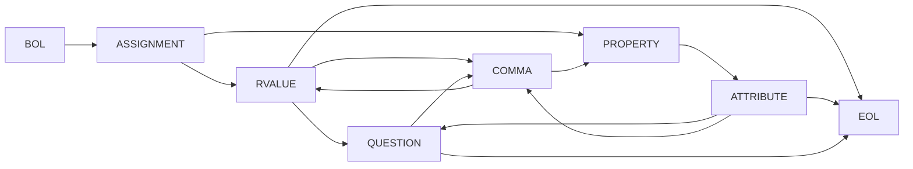
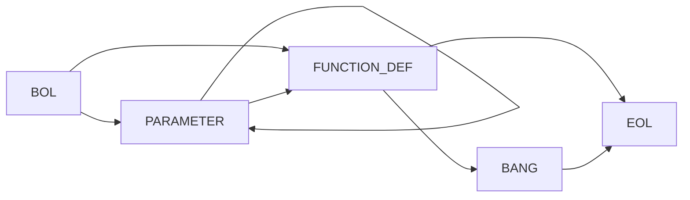
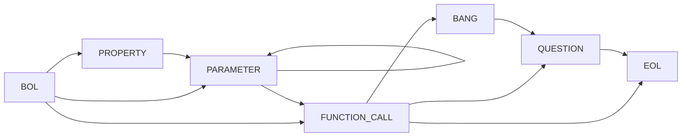
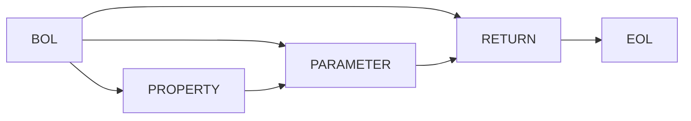
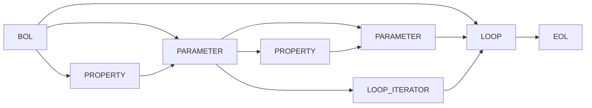
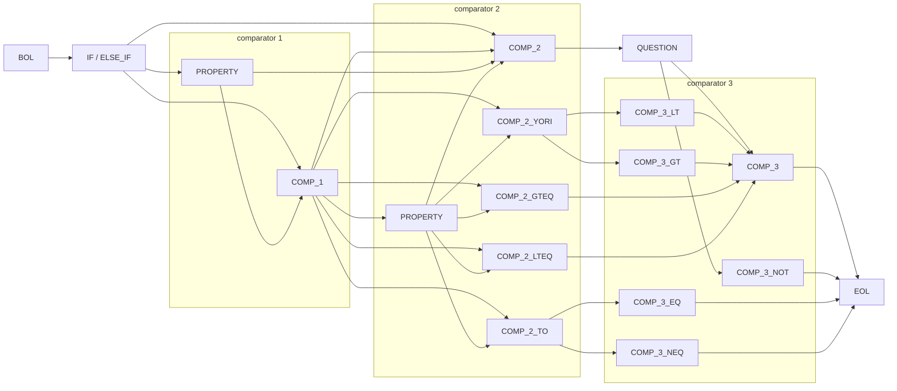
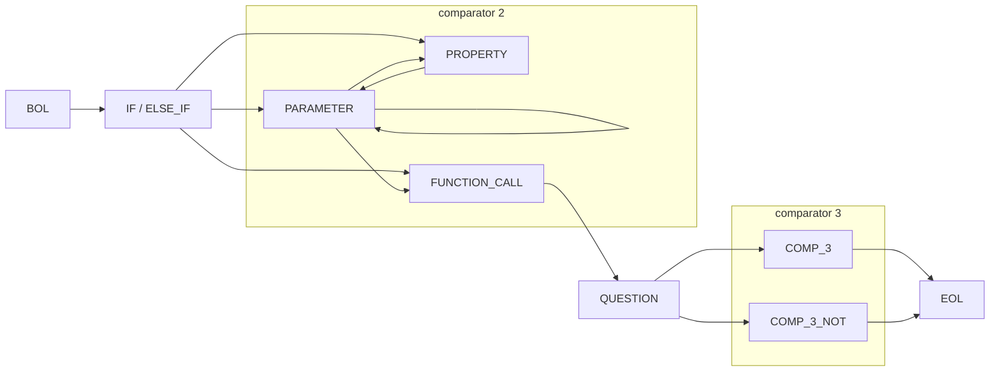

# Non-Deterministic Finite State Diagrams / 非決定性有限状態図

## ASSIGNMENT

`BOL ASSIGNMENT ( RVALUE | ( PROPERTY ATTRIBUTE ) ) QUESTION ? ( COMMA ( RVALUE | ( PROPERTY ATTRIBUTE ) ) QUESTION ? ) * EOL`



## FUNCTION\_DEF / FUNCTION\_CALL

`BOL PARAMETER * FUNCTION_DEF BANG ? EOL`



`BOL ( PROPERTY ? PARAMETER ) * FUNCTION_CALL BANG ? QUESTION ? EOL`



## RETURN

`BOL ( PROPERTY ? PARAMETER ) ? RETURN EOL`



## LOOP / LOOP\_ITERATOR / NEXT / BREAK

`BOL ( PARAMETER ( PARAMETER | LOOP_ITERATOR ) ) ? LOOP EOL`




## IF / ELSE\_IF / ELSE

```rb
BOL ( IF | ELSE_IF ) ( PROPERTY ? COMP_1 ) ? PROPERTY ? (
                                                          ( COMP_2 QUESTION | COMP_2_GTEQ | COMP_2_LTEQ ) COMP_3
                                                          | COMP_2_TO ( COMP_3_EQ | COMP_3_NEQ)
                                                          | COMP_2_YORI ( COMP_3_LT | COMP_3_GT )
                                                        ) EOL
```



`BOL ( IF | ELSE_IF ) ( PROPERTY ? PARAMETER ) * FUNCTION_CALL BANG ? QUESTION ? ( COMP_3 | COMP_3_NOT )`




## MISC


