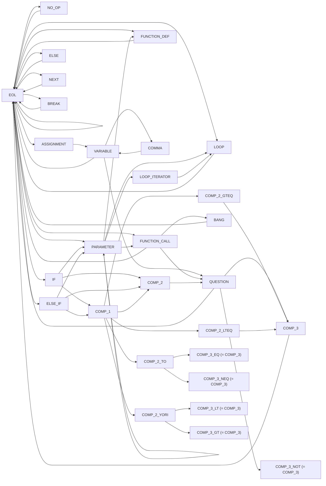

# State Diagram

```mermaid
graph LR
  EOL --> EOL
  EOL --> FUNCTION_CALL
  EOL --> FUNCTION_DEF
  EOL --> NO_OP
  EOL --> ASSIGNMENT
  EOL --> PARAMETER
  EOL --> IF
  EOL --> ELSE_IF
  EOL --> ELSE
  EOL --> LOOP
  EOL --> NEXT
  EOL --> BREAK

  ASSIGNMENT --> VARIABLE

  VARIABLE --> EOL
  VARIABLE --> QUESTION
  VARIABLE --> COMMA

  PARAMETER --> PARAMETER
  PARAMETER --> FUNCTION_DEF
  PARAMETER --> FUNCTION_CALL
  PARAMETER --> LOOP_ITERATOR
  PARAMETER --> LOOP

  FUNCTION_DEF --> EOL

  FUNCTION_CALL --> EOL
  FUNCTION_CALL --> QUESTION
  FUNCTION_CALL --> BANG

  NO_OP --> EOL

  QUESTION --> EOL
  QUESTION --> COMP_3
  QUESTION --> COMP_3_NOT["COMP_3_NOT (= COMP_3)"]

  BANG --> EOL

  COMMA --> VARIABLE

  IF --> PARAMETER
  IF --> COMP_1
  IF --> COMP_2

  ELSE_IF --> PARAMETER
  ELSE_IF --> COMP_1
  ELSE_IF --> COMP_2

  ELSE --> EOL

  COMP_1 --> COMP_2
  COMP_1 --> COMP_2_TO
  COMP_1 --> COMP_2_YORI
  COMP_1 --> COMP_2_GTEQ
  COMP_1 --> COMP_2_LTEQ

  COMP_2 --> QUESTION

  COMP_2_TO --> COMP_3_EQ["COMP_3_EQ (= COMP_3)"]
  COMP_2_TO --> COMP_3_NEQ["COMP_3_NEQ (= COMP_3)"]

  COMP_2_YORI --> COMP_3_LT["COMP_3_LT (= COMP_3)"]
  COMP_2_YORI --> COMP_3_GT["COMP_3_GT (= COMP_3)"]

  COMP_2_GTEQ --> COMP_3

  COMP_2_LTEQ --> COMP_3

  COMP_3 --> EOL

  LOOP_ITERATOR --> LOOP
  LOOP --> EOL
  NEXT --> EOL
  BREAK --> EOL
```
