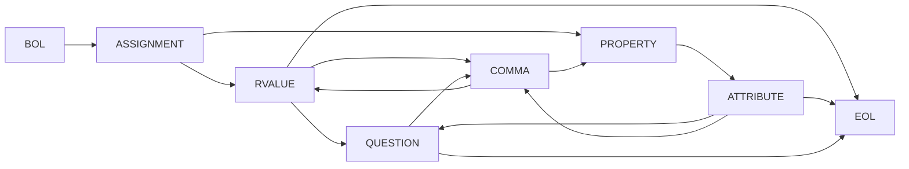
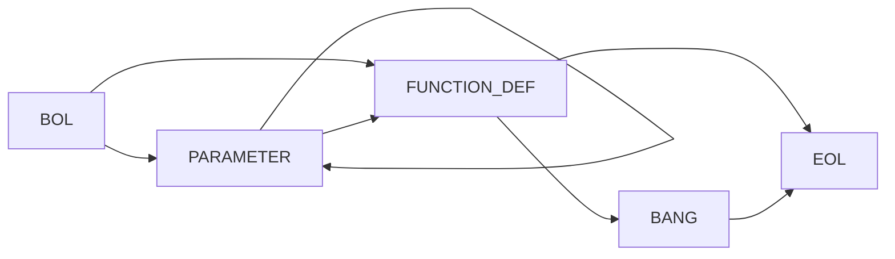
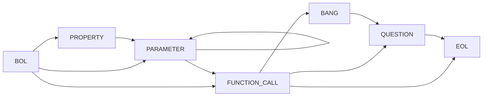
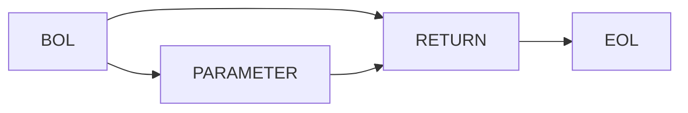
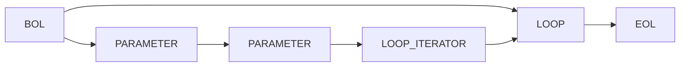
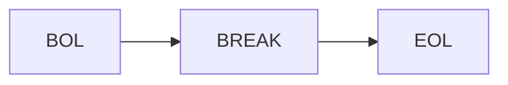
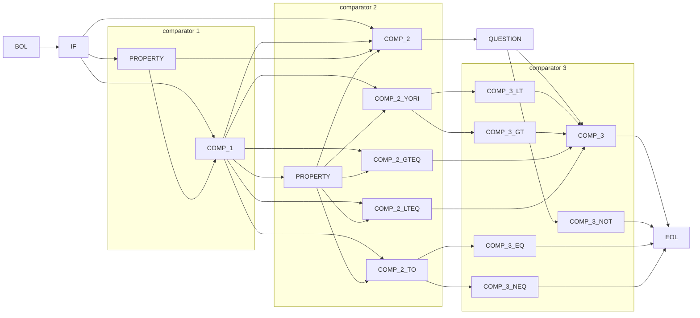
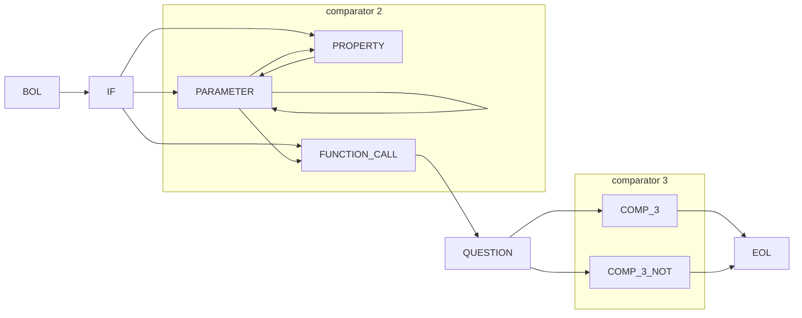

# Non-Deterministic Finite State Diagrams / 非決定性有限状態図

## ASSIGNMENT

## FUNCTION\_DEF / FUNCTION\_CALL

## RETURN

## LOOP / LOOP\_ITERATOR / NEXT / BREAK

## IF / ELSE\_IF / ELSE

**ELSE\_IF** follows the same sequence as **IF**.

