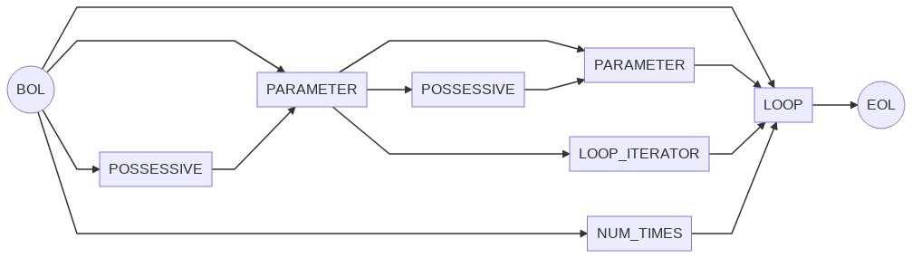
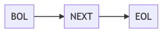
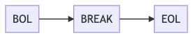
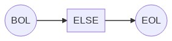

# Non-Deterministic Finite State Diagrams / 非決定性有限状態図

The diagrams below describe the different sequences supported by 金魚草's grammar. Each sequence is shown as an flowchart auto-generated by [mermaid](https://mermaid-js.github.io/mermaid/#/), and as a sort of pseudo-regex format.

## ASSIGNMENT


`BOL ASSIGNMENT ( RVALUE | ( POSSESSIVE PROPERTY ) ) QUESTION ? ( COMMA ( RVALUE | ( POSSESSIVE PROPERTY ) ) QUESTION ? ) * EOL`


## FUNCTION\_DEF / FUNCTION\_CALL


`BOL PARAMETER * FUNCTION_DEF BANG ? EOL`


`BOL ( POSSESSIVE ? PARAMETER ) * FUNCTION_CALL BANG ? QUESTION ? EOL`


## RETURN


`BOL ( POSSESSIVE ? PARAMETER ) ? RETURN EOL`


## LOOP / LOOP\_ITERATOR / NEXT / BREAK



`BOL ( PARAMETER ( PARAMETER | LOOP_ITERATOR ) ) ? LOOP EOL`








## IF / ELSE\_IF / ELSE


```rb
BOL ( IF | ELSE_IF ) POSSESSIVE ? (
  COMP_2 QUESTION ( COMP_3 | COMP_3_NOT )
  | COMP_1 POSSESSIVE ? (
    ( COMP_2 | COMP_2_GTEQ | COMP_2_LTEQ ) ( COMP_3 | COMP_3_NOT )
    | COMP_2_TO ( COMP_3_EQ | COMP_3_NEQ)
    | COMP_2_YORI ( COMP_3_LT | COMP_3_GT )
  )
) EOL
```


`BOL ( IF | ELSE_IF ) ( POSSESSIVE ? PARAMETER ) * FUNCTION_CALL BANG ? QUESTION ( COMP_3 | COMP_3_NOT ) EOL`





## MISC


