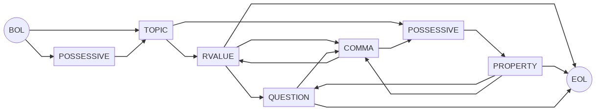
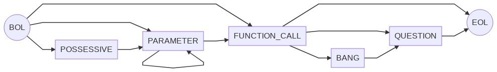
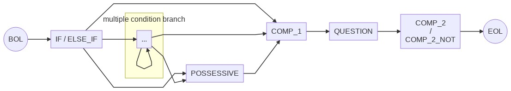
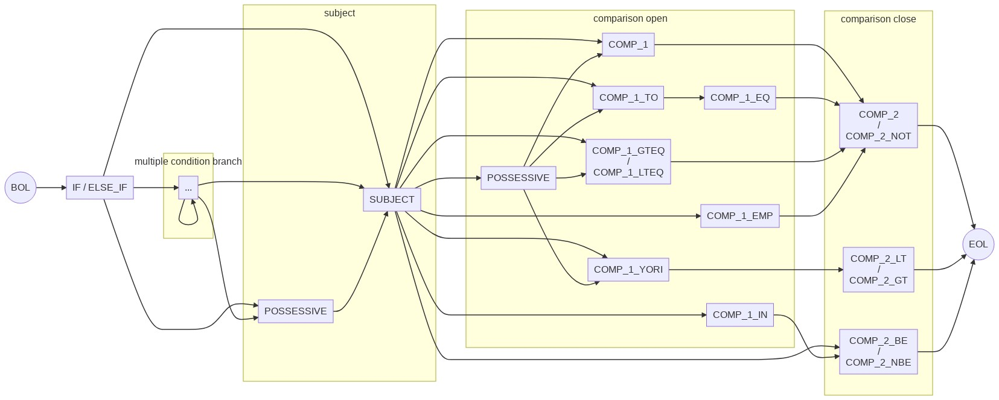
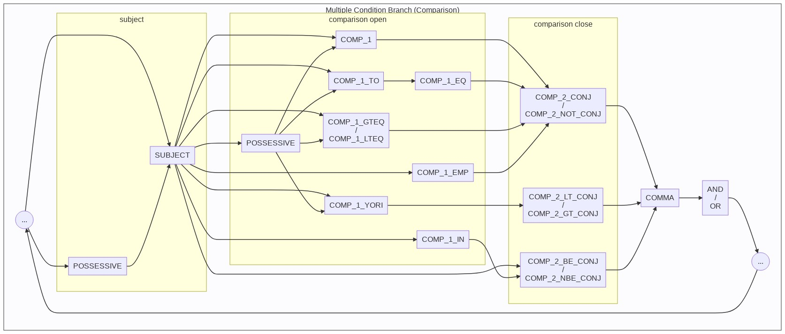
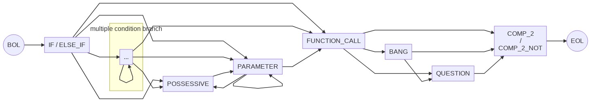

# Non-Deterministic Finite State Diagrams / 非決定性有限状態図

The diagrams below describe the different sequences supported by 金魚草's grammar. Each sequence is shown as an flowchart auto-generated by [mermaid](https://mermaid-js.github.io/mermaid/#/), and as a sort of pseudo-regex format.

## ASSIGNMENT



```
BOL
POSSESSIVE ?
ASSIGNMENT
( RVALUE | ( POSSESSIVE PROPERTY ) )
QUESTION ?
(
  COMMA
  ( RVALUE | ( POSSESSIVE PROPERTY ) )
  QUESTION ?
) *
EOL
```


## FUNCTION\_DEF / FUNCTION\_CALL


`BOL PARAMETER * FUNCTION_DEF BANG ? EOL`




`BOL ( POSSESSIVE ? PARAMETER ) * FUNCTION_CALL BANG ? QUESTION ? EOL`


## RETURN


`BOL ( POSSESSIVE ? PARAMETER ) ? RETURN EOL`


## LOOP / LOOP\_ITERATOR / NEXT / BREAK


`BOL ( PARAMETER ( PARAMETER | LOOP_ITERATOR ) | NUM_TIMES ) ? LOOP EOL`


## IF / ELSE\_IF / ELSE

The three main patterns of if-statements are broken up into "Truthy Check", "Comparison", and "Function Call". In reality, these all compose a single, three-branched regex pattern.

### Truthy Check



`BOL ( IF | ELSE_IF ) ( ... ) * POSSESSIVE ? COMP_1 QUESTION ( COMP_2 | COMP_2_NOT ) EOL`

```
graph LR
  BOL((BOL)) --> IF[IF / ELSE_IF]

  IF --> mcb["..."]
  IF --> COMP_1
  IF --> POSSESSIVE

  mcb --> mcb
  mcb --> COMP_1
  mcb --> POSSESSIVE

  COMP_1 --> QUESTION
  POSSESSIVE --> COMP_1

  QUESTION --> COMP_2["COMP_2<br>/<br>COMP_2_NOT"]

  COMP_2 --> EOL((EOL))

  subgraph multiple condition branch
    mcb
  end
```


`( POSSESSIVE ? COMP_1 QUESTION COMP_2_NOT_CONJ ? COMMA ( AND | OR ) ) *`


### Comparison



```
BOL
( IF | ELSE_IF )
( ... ) *
POSSESSIVE ? SUBJECT
POSSESSIVE ? (
  ( COMP_1 | (COMP_1_TO COMP_1_EQ) | COMP_1_GTEQ | COMP_1_LTEQ | COMP_1_EMP ) ( COMP_2 | COMP_2_NOT )
  | COMP_1_YORI ( COMP_2_LT | COMP_2_GT )
  | COMP_1_IN ( COMP_2_BE | COMP_2_NBE )
)
EOL
```




```
(
  POSSESSIVE ? SUBJECT
  POSSESSIVE ? (
    ( COMP_1 | ( COMP_1_TO COMP_1_EQ ) | COMP_1_GTEQ | COMP_1_LTEQ | COMP_1_EMP ) ( COMP_2_CONJ | COMP_2_NOT_CONJ )
    | COMP_1_YORI ( COMP_2_LT_CONJ | COMP_2_GT_CONJ )
    | COMP_1_IN ( COMP_2_BE_CONJ | COMP_2_NBE_CONJ )
  )
  COMMA
  ( AND | OR )
) *
```


### Function Call



```
BOL
( IF | ELSE_IF )
( ... ) *
( POSSESSIVE ? PARAMETER ) * FUNCTION_CALL BANG ? QUESTION ?
( COMP_2 | COMP_2_NOT )
EOL
```


`( ( POSSESSIVE ? PARAMETER ) * FUNCTION_CALL BANG ? QUESTION ? COMP_2_NOT ? ) *`


### Else


## WHILE (LOOP)

(Combination of IF / ELSE\_IF and LOOP)


```
BOL
( ... ) *
(
  POSSESSIVE ? COMP_1 QUESTION ( COMP_2_TRUE_MOD | COMP_2_FALSE_MOD )
  | ( POSSESSIVE ? PARAMETER ) * FUNCTION_CALL BANG ? QUESTION ? COMP_2_NOT_MOD ?
  | POSSESSIVE ? SUBJECT POSSESSIVE ? (
    ( COMP_1 | ( COMP_1_TO COMP_1_EQ ) | COMP_1_GTEQ | COMP_1_LTEQ | COMP_1_EMP ) ( COMP_2_MOD | COMP_2_NOT_MOD )
    | COMP_1_YORI ( COMP_2_LT_MOD | COMP_2_GT_MOD )
    | COMP_1_IN ( COMP_2_BE_MOD | COMP_2_NBE_MOD )
  )
)
WHILE
LOOP
EOL
```

Multiple condition branch uses the same states as IF / ELSE\_IF.


## MISC


